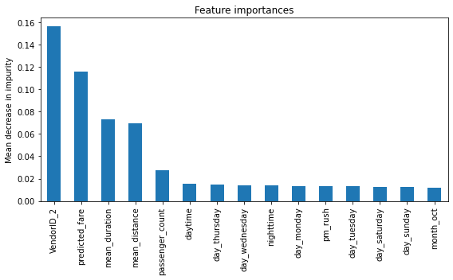

# Automatidata: NYC Taxi Generous-Tip Predictor

Predicting whether a New York City taxi rider will tip **20% or more**, using 2017 NYC TLC yellow-cab
trip data. Framed as consulting work for a fictional firm, Automatidata, this is a project from the
**Google Advanced Data Analytics Professional Certificate**.

## Results

**Champion: random forest. On the test set it finds 78% of generous tippers, with 0.72 F1.**

| Model | Split | Recall | Precision | F1 | Accuracy |
|---|---|---:|---:|---:|---:|
| Random forest | 4-fold CV | 0.757 | 0.675 | 0.714 | 0.680 |
| XGBoost | 4-fold CV | 0.724 | 0.673 | 0.698 | 0.670 |
| XGBoost | Test | 0.748 | 0.676 | 0.710 | 0.678 |
| **Random forest** | **Test** | **0.779** | **0.675** | **0.723** | **0.687** |

The classes are close to balanced: 52.6% of card-paying riders tipped at least 20%. So the model's
gain over guessing is real but moderate. False positives (predicting a generous tip that doesn't come)
are about twice as common as false negatives, which is the worse error for a driver's expectations.

Before classification, a multiple linear regression predicted the **fare** with test R² 0.83 (MAE
$2.12, RMSE $4.19). Its prediction became a feature for the classifier.

<p align="center"></p>

**What drove it:** the vendor, then the predicted fare, mean trip duration and mean distance for the
route. That `VendorID` ranks first suggests one vendor attracts more generous riders, which is worth a
statistical test of its own.

## How the target was built

- Only credit-card trips are used. Cash tips aren't recorded, so cash trips show $0.
- `tip_percent = tip_amount / (total_amount − tip_amount)`, rounded to 3 places. Without rounding, floating-point error mislabels about 1,800 riders who did tip 20%.
- `generous = tip_percent ≥ 0.20`.

## The workflow

Each stage has a notebook and an executive summary, following Google's PACE framework
(Plan, Analyze, Construct, Execute):

| # | Stage | Notebook | Summary |
|---|---|---|---|
| 1 | Data inspection | [Notebook](Automatidata/Automatidata%20project%20lab.ipynb) | [PDF](Automatidata/Preliminary%20Automatidata%20executive%20summary.pdf) |
| 2 | Exploratory data analysis | [Notebook](Automatidata/Exploratory_Data_Analysis/Automatidata%20project%20lab.ipynb) | [PDF](Automatidata/Exploratory_Data_Analysis/Exploratory%20Data%20Analysis%20Automatidata%20Executive%20Summary.pdf) |
| 3 | Statistics and A/B test | [Notebook](Automatidata/Statistical_Review_and_AB_Testing/Automatidata%20project%20lab.ipynb) | [PPTX](Automatidata/Statistical_Review_and_AB_Testing/Statistical_and_AB_testing_Executive_Summary.pptx) |
| 4 | Fare regression | [Notebook](Automatidata/Building_a_Multiple_Linear_Regression_Model/Automatidata%20project%20lab.ipynb) | [PPTX](Automatidata/Building_a_Multiple_Linear_Regression_Model/Automatidata_Regression_Executive%20Summary.pptx) |
| 5 | **Tip classifier** | [Notebook](Automatidata/Building_a_Machine_Learning_Model/Automatidata%20project%20lab.ipynb) | [PPTX](Automatidata/Building_a_Machine_Learning_Model/Automatidata_Executive_summary_Classifiers.pptx) |

The project plan is in the [PACE strategy document](Automatidata/PACE%20strategy%20document.pdf).
The trip data sample is [`2017_Yellow_Taxi_Trip_Data.csv`](Automatidata/2017_Yellow_Taxi_Trip_Data.csv).

## Run it

```bash
pip install pandas numpy scikit-learn xgboost matplotlib seaborn scipy jupyter
jupyter notebook
```

## Stack

Python · pandas · scikit-learn · XGBoost · SciPy · matplotlib / seaborn
